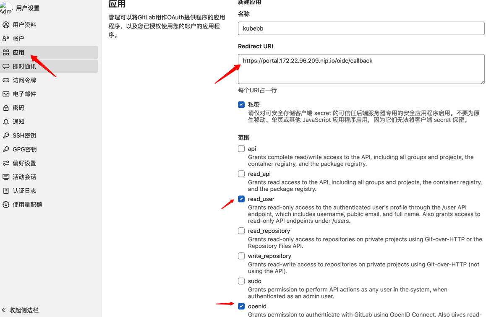
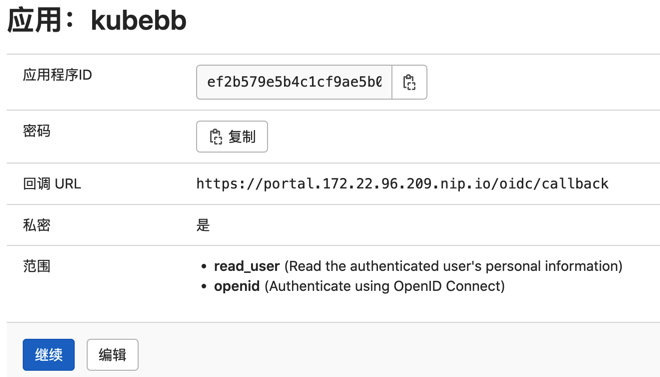

# 使用第三方系统登录
目前基于 dex 支持外部认证系统的集成，实现服务门户与第三方认证系统的统一账号及单点登录。

## 1. Gitlab 集成
参考以下步骤进行 Gilab 登录的集成

### 1.1 在 Gitlab 中配置应用账号
1. 使用root用户登录后，点击右上角用户的头像，然后点击偏好设置
  

2. 在左侧菜单导航处选择“应用”，然后在新建应用中，填写必要信息：
- 名称：根据需要填写
- 回调地址：<u4a-component 地址>/oidc/callback
- 范围：勾选 read_user 和 openid
  


3. 保存应用，点击页面下刚刚保存的应用，得到下图。
  

记录 应用程序ID（clientid）、密码（clientsecret） 以及 回调 URL（redirecturl），需要在oidc-server 端进行相应配置。

4. 编辑 oidc-server 的配置文件，增加一种新的 connector 配置，`kubectl edit cm  oidc-server  -n u4a-system`，按以下示例进行配置：

```yaml
connectors:
- type: k8scrd
  ...
- type: gitlab                ## 固定值 gitlab
  name: gitlab                ## 名称
  id: gitlab                  ## 固定值 gitlab
  config:
    baseURL: http://gitlab.172.22.50.155.nip.io         ## gitlab对外访问的地址
    clientID: ef2b579e5b4c1cf9ae5b0b2acb166271ebff5892e84aa113689d4646ffcb29e7  ## gitlab配置的应用的clientID， 可在上一步骤”配置gitlab“中获取
    clientSecret: 3a9e79368a70bcdf1e4ac1df64e4220e7af798876333c9642a8edb782e6eb558  ## gitlab配置的应用的密码， 可在上一步骤”配置gitlab“中获取
    redirectURI: https://portal.172.22.96.209.nip.io/oidc/callback  ## gitlab配置的callback地址， 可在上一步骤”配置gitlab“中获取
```
5. 开启第三方系统对接，目前支持 gitlab/github 两种，仅需要将对应的 enabled 字段设置为 true 即可。
- kubectl edit connector3rd connector3rd
```yaml
kind: Connector3rd
metadata:
  annotations:
    helm.sh/hook: post-install,post-upgrade
    helm.sh/hook-weight: "-5"
  name: connector3rd
spec:
  connectors:
  - description: gitlab description
    enabled: false # 修改为 true
    icon: <保持不变>
    id: gitlab
    name: gitlab
  - description: github description
    enabled: false
    icon:  <保持不变>
    id: github
    name: github
```

6. 通过第三方登录时，需要在 oidc-server 的 configMap 中的 staticClients -> redirectURIs 添加新的重定向地址：

https://portal.172.22.96.209.nip.io/dock-app?third_party_bind_login=true

7. 配置完毕后，重启 oidc-server 服务即可生效，此时再次访问登录页面，既可看到对应的登录图标。

  
