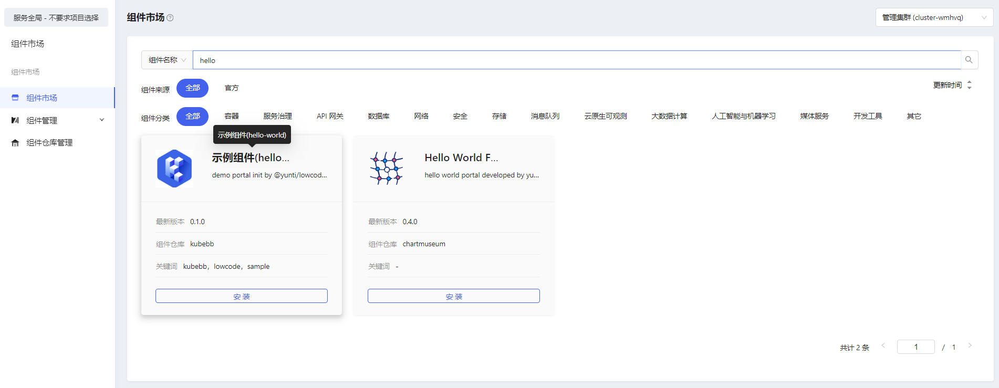
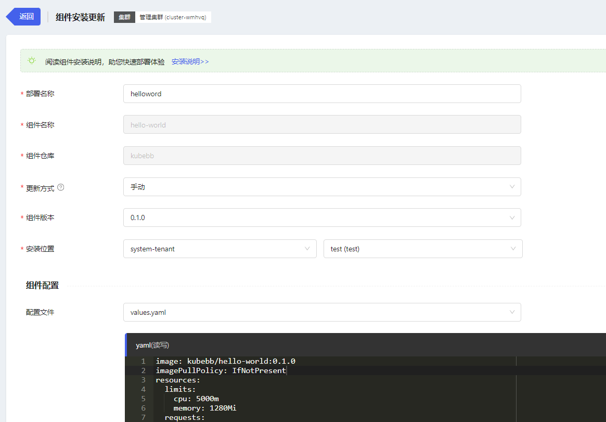
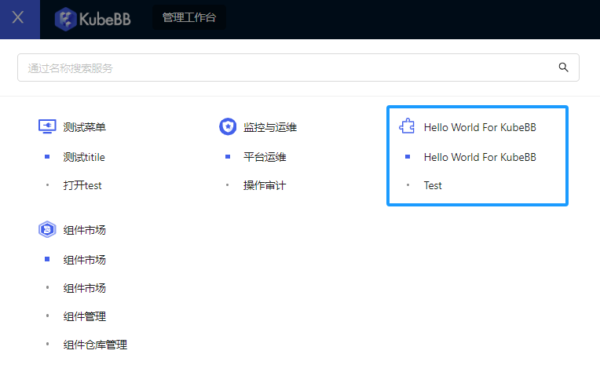

# 发布 HelloWorld 组件

:::tip 前提条件
已完成 Kubebb 的安装，参考[安装 Kubebb](./quick-install.md)
:::

Kubebb 安装完成后，可通过[官方组件仓库](https://github.com/kubebb/components)快速体验组件的部署和使用。本章节主要以 HelloWorld 组件为例，演示组件发布、安装、使用流程。

    kubebb 为内置的官方组件仓库，提供多功能组件。 HelloWorld 组件作为演示组件内置在<组件市场>中。

1. 进入【组件市场/组件仓库管理】，即可查看到仓库 `kubebb`，如果没有，可手动添加

```shell
kubectl apply -f https://raw.githubusercontent.com/kubebb/components/main/repos/repository_kubebb.yaml
```

2. 进入【组件市场/组件市场】，搜索“hello”，如下图，示例组件（hello-world）



3. 单击组件卡片的**安装**，进入安装页面，示例组件各选项配置说明如下：填写部署名称，选择组件版本，选择安装位置（租户、项目），检查 values.yaml。

- 部署名称：例helloworld，`由3~53个小写字母、数字、中划线“-”组成，并以字母、数字开头或结尾`
- 更新方式：默认手动即可
- 组件版本：默认第一个0.1.0即可
- 安装位置：按您需要选择租户、项目
- values.yaml：无需改动。如果安装其他组件，请点击页面上方 “安装说明” 查看是否需要调整配置文件内容。
- 镜像替换：本示例暂无需添加替换规则



4. 点击**确定**，开始安装，自动跳转到所选租户、项目&集群的<我安装的>列表页面，查看安装结果。
5. 安装成功后，刷新页面，点击左上角所有菜单，可见，至此完成组件安装、使用流程。

